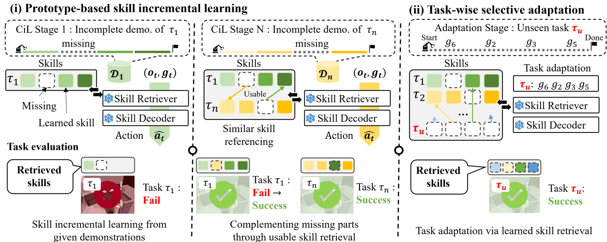

# Incremental Learning of Retrievable Skills for Efficient Continual Task Adaptation (IsCiL)

This repository provides the official implementation of our paper:

[Incremental Learning of Retrievable Skills for Efficient Continual Task Adaptation](https://openreview.net/pdf?id=RcPAJAnpnm)

---

## Overview



**Continual Imitation Learning (CiL)** involves extracting and accumulating task knowledge from demonstrations across multiple stages and tasks to achieve a multi-task policy. With recent advancements in foundation models, there has been a growing interest in **adapter-based CiL approaches**, where adapters are introduced in a parameter-efficient way for newly demonstrated tasks. While these approaches effectively isolate parameters for different tasks—helping mitigate catastrophic forgetting—they often limit **knowledge sharing** across tasks.

We introduce **IsCiL**, an **adapter-based CiL framework** that addresses the limitation of knowledge sharing by incrementally learning **shareable skills** from different demonstrations. This enables **sample-efficient task adaptation**, especially in non-stationary CiL environments. In IsCiL, demonstrations are mapped into a state embedding space, where **proper skills** can be retrieved from a **prototype-based memory**. These retrievable skills are then incrementally refined on their own **skill-specific adapters**. Our experiments on complex tasks in **Franka-Kitchen** and **MetaWorld** demonstrate robust performance of IsCiL in both **task adaptation** and **sample efficiency**. Additionally, we provide a simple extension of IsCiL for **task unlearning** scenarios.


**Implementation highlights:**
- **Continuous creation of skill-specific adapters.**
  1. **K-means** is used to build skill bases, improving the accuracy of similarity searches between inputs and the corresponding skill.
  2. **Evaluation** is performed by applying each skill adapter to a pre-trained model, enabling effective handling of new or changing inputs.

---

## Table of Contents

1. [Installation](#installation)  
2. [Environment Setup](#environment-setup)  
3. [Dataset and Environment Setup](#dataset-and-environment-setup)  
4. [Running the Experiments](#running-the-experiments)  
5. [Error Management and Troubleshooting](#error-management-and-troubleshooting)

---

## Installation

### Note
`clus` is the development version name for `iscil`. All related implementations are located inside the `clus` directory.

### Requirements
- Python 3.10.13
- [mujoco210](https://github.com/openai/mujoco-py)

### Step 1: Create a Conda Environment

1. Create and activate a conda environment using the `environment.yml` file:
   ```bash
   conda env create -f environment.yml
   conda activate iscil
