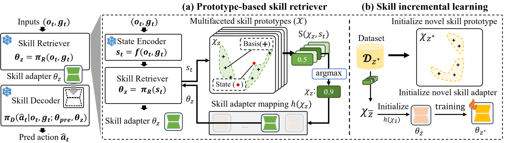

# Incremental Learning of Retrievable Skills for Efficient Continual Task Adaptation (IsCiL)

This repository provides the official implementation of our paper:
[Incremental Learning of Retrievable Skills for Efficient Continual Task Adaptation](https://openreview.net/pdf?id=RcPAJAnpnm)

Poster : [NeurIPS2024](https://neurips.cc/virtual/2024/poster/95159)

#Incremental Learning #Imitation Learning #Skills #NeurIPS2024

---

## Overview


**Continual Imitation Learning (CiL)** involves extracting and accumulating task knowledge from demonstrations across multiple stages and tasks to achieve a multi-task policy. With recent advancements in foundation models, there has been a growing interest in **adapter-based CiL approaches**, where adapters are introduced in a parameter-efficient way for newly demonstrated tasks. While these approaches effectively isolate parameters for different tasks—helping mitigate catastrophic forgetting—they often limit **knowledge sharing** across tasks.

We introduce **IsCiL**, an **adapter-based CiL framework** that addresses the limitation of knowledge sharing by incrementally learning **shareable skills** from different demonstrations. This enables **sample-efficient task adaptation**, especially in non-stationary CiL environments. In IsCiL, demonstrations are mapped into a state embedding space, where **proper skills** can be retrieved from a **prototype-based memory**. These retrievable skills are then incrementally refined on their own **skill-specific adapters**. Our experiments on complex tasks in **Franka-Kitchen** and **MetaWorld** demonstrate robust performance of IsCiL in both **task adaptation** and **sample efficiency**. Additionally, we provide a simple extension of IsCiL for **task unlearning** scenarios.



**Implementation highlights:**
- **Incremental creation of skill-specific adapters.**
  1. **K-means** is used to build skill bases, improving the accuracy of similarity searches between inputs and the corresponding skill.
  2. **Evaluation** is performed by applying each skill adapter to a pre-trained model, enabling effective handling of new or changing inputs.
---

## Table of Contents

1. [Installation](#installation)
2. [Environment Setup](#environment-setup)
3. [Dataset and Environment Setup](#dataset-and-environment-setup)
4. [Running the Experiments](#running-the-experiments)
5. [Error Management and Troubleshooting](#error-management-and-troubleshooting)

---

## Installation

### Note
`clus` is the development version name for `iscil`. All related implementations are located inside the `clus` directory.

### Requirements
- Python 3.10.13
- [mujoco210](https://github.com/openai/mujoco-py)

### Step 1: Create a Conda Environment

1. Create and activate a conda environment using the `environment.yml` file:
   ```bash
   conda env create -f environment.yml
   conda activate iscil
   ```
2. Verify successful activation:
   ```bash
   conda info --envs
   ```

### Step 2: Install Specific Package Versions
We rely on a specific version of `gym`:
```bash
pip install setuptools==65.5.0 "wheel<0.40.0"    # Prevents an error when installing gym 0.21.0
pip install gym==0.21.0
```
For more details on why the first line is required, see:  
[Why is pip install gym failing?](https://stackoverflow.com/questions/76129688/why-is-pip-install-gym-failing-with-python-setup-py-egg-info-did-not-run-succ)

### Step 3: Install the Project
In your project directory, run:
```bash
pip install -e .
```

### Step 4: Set Environment Variables
Make sure the following environment variables are set:
```bash
export clus_path="/home/[exp_path]/clus"
export XLA_PYTHON_CLIENT_PREALLOCATE=false
```
Replace `[exp_path]` with the actual path on your system.

---

## Environment Setup

If the steps above are completed, you can test the Kitchen environment directly. For Metaworld, follow the instructions below.

### Download and Organize Datasets and Environments

1. Download environment files from the following link:  
   [Google Drive](https://drive.google.com/file/d/1x9FjohGHyultblhQFZXXLs_FhaTYlg5F/view?usp=drive_link)

2. After downloading:
   - Unzip the file and locate the `IsCiL_Env/data` folder.
   - For each environment folder, install it:
     ```bash
     # For mmworld
     cd IsCiL_Env/env/mmworld
     pip install -e .

     # For Metaworld
     cd ../Metaworld
     pip install -e .
     ```
   - Return to the root directory if necessary.

---

## Dataset and Environment Setup

The above steps cover both dataset and environment requirements (e.g., Kitchen, Metaworld). Make sure you have everything installed before proceeding.

---

## Running the Experiments

### Download Pre-Trained Models
1. Download the `pre_trained_models.zip` file from the provided link:  
   [Download](https://drive.google.com/file/d/1KbYd3hJWG6yr0sKuB9i4WmVDCS5Uefz1/view)
2. Move the file to `data` and unzip it.
3. Check that the contents are properly placed in the `data/pre_trained_models` directory.

### Run IsCiL
To run the IsCiL experiment, navigate to the `clus` directory and execute:
```bash
bash src/IsCiL.sh
```
This script will launch the incremental learning process described in the paper.

---

## Error Management and Troubleshooting

Occasionally, you might encounter errors when running the scripts. Below are common issues and how to fix them.

### Manual Library Dependency Troubleshooting

If errors occur while running:
```bash
bash src/IsCiL.sh
```
you can identify problematic imports by checking the console logs. Please note these possible fixes:

#### 1) Modify Library Imports (qax)
Some code modifications may be necessary due to updated JAX libraries:
- Replace occurrences of `jax.linear_util` with `jax.extend.linear_util` in:
  - `[qax package directory]/qax/implicit/implicit_array.py`
  - `[qax package directory]/qax/implicit/implicit_utils.py`

#### 2) D4RL Issues
If you get errors related to `abc`, ensure `collections.abc.Mapping` is used instead of `collections.Mapping` in:
  - `[D4RL package directory]/kitchen/adept_envs/mujoco_env.py`

#### 3) W&B Installation Error
If you encounter wandb installation errors, simply reinstall wandb:
```bash
pip install wandb
```

---

Enjoy exploring **Incremental Learning of Retrievable Skills for Efficient Continual Task Adaptation**!